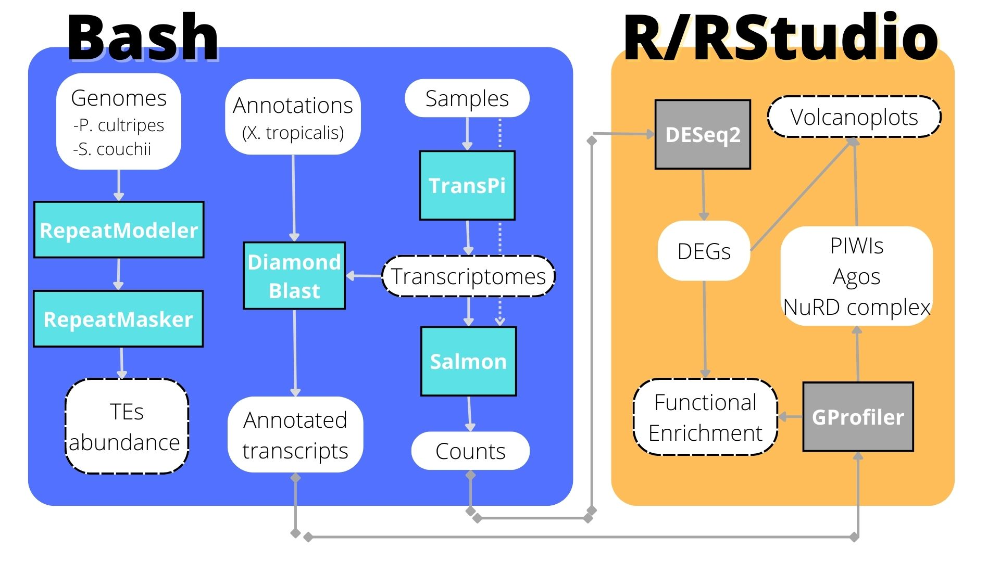

# TFM - Abundance, but not regulation of transposable elements differs between frogs with widely different genome sizes and developmental plasticity
### Paula Sianes Castillo

This is the front page of my git website dedicated to my TFM. My project consisted in measuring the abundance of transposable elements (TEs) in the genome of two closely related toad species, as well as the activity of TEs silencing genes.

Here I present an schematic image of my analysis.\

Below are links to the different workflows for my TFM:

* [Study System](Study_system.md)
* [Running the TransPi pipeline](transpi.md)
* [Finding Repetitive Transposable Elements](repeats.md)
* [Functional annotations](functional_annotation_blastx.md)
* [Transcript quantification and exportation]()
* [Differential gene expression](DEGs_24h.Rmd)
* [Functional enrichment analysis](Functional_enrichment.Rmd)
* [Supplementary information](supplementary_material.md)

